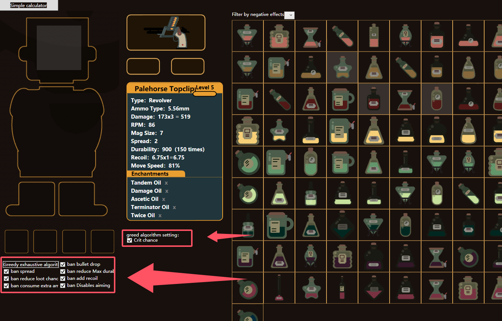

    Calculator make things easy for figure out which oil is good and what plan is best.

    The button "Greedy exhaustive algorithm" is for pick a best oil in current state.
    you also can pick oils yourself at right.

    oil was arranged by color, every color represent one kind of positive effect.
    you also can filter by negative effect.

    To see what damage the oil you have can do, disable the magic oil you don't have in the ∞ exhaustion subwindow, and the calculator can work out the best solution for you.

    this game ask you kill enemy as quick as you can, and caclculator provide a information of "damage in one minute" for reference.

    Export ranking file

